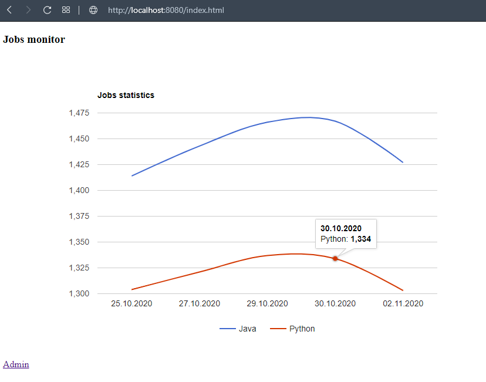
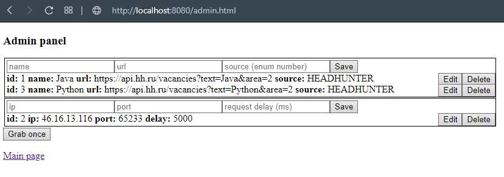

# JobsMonitor

## Implementation details
* Spring Framework
* Vue.js
* PostgreSQL
* Google Charts
* Apache Maven
* Lombok
* Log4j

## About application
This project contains two parts:
* Web application that displays vacancies statistics with various filters. It has an admin panel.
* Grabber for collecting information about vacancies from open sources via proxies. It can run on schedule or using the "Grub once" button in the admin panel.

## Screenshots
### Main page

### Admin panel

